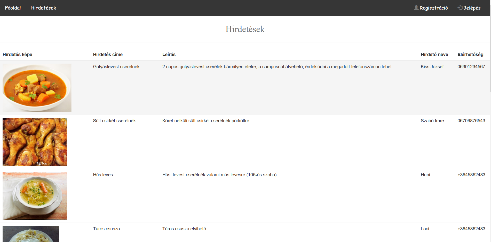
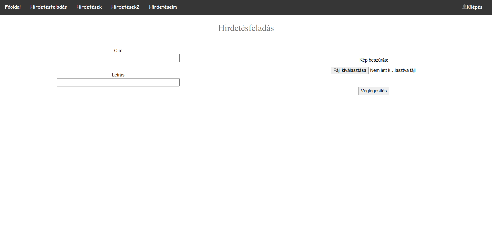
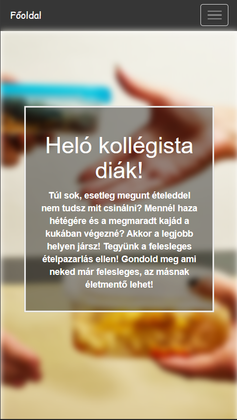

# Funkcionális specifikáció

## Bevezetés

Az egyetemre járók többsége kollégista. Vannak, akik a helyi menzán étkeznek a hét 
folyamán vagy  rendelik az ételt és vannak azok, akik a kollégiumban főznek maguknak
vagy a hétvége után hazulról hoznak magukkal elemózsiát a hétre. Ha egyszerre több
adagot hoz egyfajta ételből az ember, megesik, hogy a 3. napra megunja azt és már nem
szívesen eszi. Erre a problémára szeretnénk megoldást találni, hogy a megmaradt 
étel ne vesszen kárba. 

Weboldalunk célja , hogy a megmaradt étel ne a kukába landoljon, hanem új gazdára
találjon.  Habár az is egy megoldás lenne ha személyesen járnánk utána az étel 
cserének, de mivel ez 21. század ezért egy ilyen weboldal sokkal gyorsabb és kényelmesebb
megoldást tud nyújtani erre a célra. Ezzel a megoldással párhuzamosítani lehet a cseréket,
vagyis nem kerül nagyobb energiabefektetésbe ha több elcserélni kívánt kajánk van.

## Használati esetek 

* Ezzel a fórummal lehetőséget teremtünk a kollégiumi diákoknak, hogy a megunt ételeiket
el tudják cserélni.
* Az alkalmazás bárki által használható , további funkciók a belépést követően érhetőek 
el.
* A felhasználónak lehetősége van mindig látható menü segítségével a cserére kívánt 
ételek között válogatni.
* Weboldal megnyitása után a következő funkciók lesznek elérhetőek:
  * Regisztráció 
  * Belépés
  * Hirdetések 
  * Főoldal
  * Hirdetésfeladás
  * Hirdetéseim

* A regisztráció gombra kattintva a következő adatokat kell megadni: felhasználónév,
jelszó, jelszó megerősítése, teljes név és elérhetőség.
* A belépés funkciót választva a felhasználónevet és a jelszót kell megadni. A bejelentkezésen
belül is megtalálható egy regisztráció gomb.
* A hirdetések menüpont alatt megtalálható az összes eddig feltöltött hírdetések címe,
ételek képe , leírásaik , feladók nevei , elérhetőségeik.
* A főoldalon megtalálható az üdvözlő szöveg az újonnan regisztrált felhasználóknak.
* A hirdetésfeladáskor meg kell adni a címet, a leírást majd az ételről készült képet.
* A hirdetéseim funkció kiírja a már az adott felhasználó által feltöltött hirdetés 
címét és leírását.
* A bejelentkezés után lehetőség van a hirdetések menüpont nézeteinek váltására.  

##	Jelenlegi helyzet leírása

A megfelelő fórumok hiánya miatt az emberek az így megmaradt ételeket nem tudják
elcserélni, ezért azok nagy része pocsékba megy, mert senki sem fog szobáról szobára
kopogtatni a megmaradt egy tányér húslevesével. Erre egy egyszerűbb megoldás lehet,
ha csere/ajándék szándékát egy fórumon jelzi és az erre igényt tartó egyén jelentkezik.

##	Vágyálomrendszer leírása

Célunk egy olyan fórum létrehozása, melyhez bárki szabadon csatlakozhat és megoszthatja
cserélni/ajándékozni kívánt elemózsiáját. Emellett szeretnénk, ha kollégiumi 
kapcsolatok/közösségek alakulnának ki. Nem utolsó sorban ezen fórum létrehozásával
a környezetszennyezés és ételpazarlás ellen is harcolnánk. 

További fejlesztési terveink közé tartozik egy módosítás menüpont, amiben a felhasználó
a regisztrációban megadot nevet, elérhetőséget és jelszót tud változtatni. Illetve, 
hogy a felhasználó képes legyen saját hirdetéseinek törlésére. Távolabbi célunk egy
értéklő rendszer kipítése a felhasználók között. Nem utolsó sorban, azt is szeretnénk 
elérni, hogy felhasználó barátabb és átláthatóbb legyen az oldal.

##	Követelménylista

*	A weboldal reszponzivitásának eléréséhez bootstrapet használjuk, így a fórum 
bármilyen eszközön elérhető lesz (telefon, tv, pc, tablet) 
*	Olyan platform létrehozása, ahol a felhasználók valós időben tudják megosztani 
tartalmaikat, amelyen elérhetik egymást
*	Adminok, akik korlátlan jogosultsággal bírnak és felügyelik az oldal működését
*	Saját profil létrehozása
*	Felhasználók értékelése a megbízhatóság alapján
*	Profil módosítása 
*	Hirdetések törlése 
*	Értékelő rendszer létrehozása

##  Képernyő tervezete

A weboldalra való belépéskor a főoldalon találjuk magunkat. Itt találhatóak meg:
* Regisztráció 
* Belépés
* Hirdetések 
* Főoldal
* Hirdetésfeladás
* Hirdetéseim.

Maga a weboldal így néz ki :

Gépi nézeti hirdetések:

Gépi nézeti hirdetésfeladás:

Mobil nézeti főoldal:

