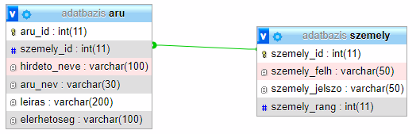

# Rendszerterv

## 1. Bevezetés

Start-up-unk célja egy olyan mindenki számára elérhető platform, mely segítséget nyújt a kollégistáknak. Emelett, egy olyan csere/ajándékozás célú
felületet szeretnénk biztosítani, amivel hozzájárulhatunk az ételpazarlás csökkentéséhez.

## 2. A rendszer céljai

- a rendszernek saját adatbázissal kell rendelkeznie amit a weboldal is elér
- az adatbázisban tárolni kell a felhasználó:
    1. nevét
    2. jelszavát
    3. értékelését 
- továbbá a hirdetés címét, leírását és a feladó telefonszámát
- a weboldalon a felhasználó számára elérhetőnek kell lennie:
    1. a fórumnak
    2. főoldalnak
    3. többi felhasználó profiljának
- a weboldal fórumának elérhetőnek kell lenni minden felhasználó számára
- minden felhasználónak lehetőséget kell adni a hirdetés feladásra (bejelentkezés után), illetve a hirdetés törlésére

## 3. Adatbázis terv

## 4. Projekt terv

Jelen projekten 4 hallgató dolgozik:  
| Név             | Szak                  |
|:----------------:|:------------------------:|
| Gudor Hunor     | Programtervező informatikus|
| Maródi Bence    | Programtervező informatikus|
| Tóth Ferenc     | Programtervező informatikus|
| Vékony Orsolya  | Programtervező informatikus|

## 5. Ütemterv

- 2021.09.06. - 2021.09.13. : csapatok kialakítása, ötletelés
- 2021.09.13. - 2021.09.20. : Követelmény- és Funkcionális specifikáció elkészítése
- 2021.09.20. - 2021.09.27. : Rendszerterv elkészítése, projekt elkezdése
- 2021.09.27. - 2021.10.04. : Projekt befejzése
- 2021.10.04. : Projekt bemutatása, értékelés
- 2021.10.11.-2021.10.18. : ötletelés a projekt továbbfejlesztéséhez
- 2021.10.18.2021.10.25. : Követelmény- és Funkcionális specifikáció, valamint a Rendszerterv bővítése, kiegészítése

## 6. Mérföldkövek

A projekt elkészítésének mérföldkövei:
- Trello regisztráció, ismerkedés a felülettel
- Discord szerver létrehozása (a könyebb kommunikációhoz)
- Github repó elkészítése
- Követelmény specifikáció megírása
- Funkcionális specifikáció megírása
- Rendszerterv elkezdése
- Projekt fejlesztésének elkezdése
- Projekt fejlesztése

## 7. Üzleti szereplők

- weblapot kezelő adminok
- weblapot látogató/használó felhasználók

## 8. Funkcioális követelmények

- egyszerűen kezelhető, mindenki számára elérhető platform
- jól átlátható felület
- jól átlátható adatbázis kezelés
- könnyű hirdetés feladás

## 9. Nem funcionális követelmények

- esztétikus, jól elrendezett weboldal
- megfelelő színek, betűméretek használata

## 10. Funkcionális terv

- a weboldal célja a kollégiumi ételpazarlás lecsökkentése
- az ételek cseréje/adományozása

## 11. Fejlesztői eszközök

- PHP
- MySQL
- JavaScript
- CSS

## 12. Biztonság

Az adatbázisban tárolt felhasználói jelszavak MD5-ös titkosítással rendelkeznek. 
