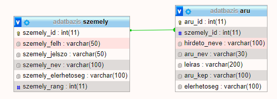

# Rendszerterv


##  Bevezetés

Start-up-unk célja egy olyan mindenki számára elérhető platform, mely segítséget nyújt
a kollégistáknak. Emelett, egy olyan csere/ajándékozás célú felületet szeretnénk 
biztosítani, amivel hozzájárulhatunk az ételpazarlás csökkentéséhez.


##  A rendszer céljai

- a rendszernek saját adatbázissal kell rendelkeznie amit a weboldal is elér
- az adatbázisban tárolni kell a felhasználó:
    1. nevét
    2. jelszavát
    3. értékelését 
- továbbá a hirdetés címét, leírását és a feladó telefonszámát
- a weboldalon a felhasználó számára elérhetőnek kell lennie:
    1. a fórumnak
    2. főoldalnak
    3. többi felhasználó profiljának
- a weboldal fórumának elérhetőnek kell lenni minden felhasználó számára
- minden felhasználónak lehetőséget kell adni a hirdetés feladásra (bejelentkezés után),
 illetve a hirdetés törlésére
 

##  Adatbázis terv




##  Az adatbázist legeneráló sql script:

```sql

CREATE TABLE `aru` (
  `aru_id` int(11) NOT NULL,
  `szemely_id` int(11) NOT NULL,
  `hirdeto_neve` varchar(100) COLLATE utf8_hungarian_ci NOT NULL,
  `aru_nev` varchar(30) COLLATE utf8_hungarian_ci NOT NULL,
  `leiras` varchar(200) COLLATE utf8_hungarian_ci NOT NULL,
  `aru_kep` varchar(100) COLLATE utf8_hungarian_ci NOT NULL,
  `elerhetoseg` varchar(100) COLLATE utf8_hungarian_ci NOT NULL
) ENGINE=InnoDB DEFAULT CHARSET=utf8 COLLATE=utf8_hungarian_ci;

CREATE TABLE `szemely` (
  `szemely_id` int(11) NOT NULL,
  `szemely_felh` varchar(50) COLLATE utf8_hungarian_ci NOT NULL,
  `szemely_jelszo` varchar(50) COLLATE utf8_hungarian_ci NOT NULL,
  `szemely_nev` varchar(100) COLLATE utf8_hungarian_ci NOT NULL,
  `szemely_elerhetoseg` varchar(100) COLLATE utf8_hungarian_ci NOT NULL,
  `szemely_rang` int(11) NOT NULL
) ENGINE=InnoDB DEFAULT CHARSET=utf8 COLLATE=utf8_hungarian_ci;

```


##  Projekt terv

Jelen projekten 4 hallgató dolgozik:  
| Név             | Szak                  |
|:----------------:|:------------------------:|
| Gudor Hunor     | Programtervező informatikus|
| Maródi Bence    | Programtervező informatikus|
| Tóth Ferenc     | Programtervező informatikus|
| Vékony Orsolya  | Programtervező informatikus|


##  Ütemterv

- 2021.09.06. - 2021.09.13. : csapatok kialakítása, ötletelés

- 2021.09.13. - 2021.09.20. : Követelmény- és Funkcionális specifikáció elkészítése

- 2021.09.20. - 2021.09.27. : Rendszerterv elkészítése, projekt elkezdése

- 2021.09.27. - 2021.10.04. : Projekt befejzése

- 2021.10.04. : Projekt bemutatása, értékelés

- 2021.10.11. - 2021.10.18. : Ötletelés a projekt továbbfejlesztéséhez

- 2021.10.18. - 2021.10.25. : Követelmény- és Funkcionális specifikáció, valamint a Rendszerterv 
bővítése, kiegészítése

- 2021.10.25. - 2021.11.01. : Követelmény- és Funkcionális specifikáció, valamint a Rendszerterv 
bővítése, kiegészítése

- 2021.11.01. - 2021.11.08. : Fejlesztési szünet

- 2021.11.08. - 2021.11.15. : Demó elkészítése


##  Mérföldkövek

A projekt elkészítésének mérföldkövei:
- Trello regisztráció, ismerkedés a felülettel
- Discord szerver létrehozása (a könyebb kommunikációhoz)
- Github repó elkészítése
- Követelmény specifikáció megírása
- Funkcionális specifikáció megírása
- Rendszerterv elkezdése
- Projekt fejlesztésének elkezdése
- Projekt fejlesztése
- Követelmény specifikáció bővítése
- Funkcionális specifikáció bővítése
- Rendszerterv bővítése
- Demó Befejezése


##  Üzleti szereplők

- weblapot kezelő adminok
- weblapot látogató/használó felhasználók


##  Funkcioális követelmények

- egyszerűen kezelhető, mindenki számára elérhető platform
- jól átlátható felület
- jól átlátható adatbázis kezelés
- könnyű hirdetés feladás


##  Nem funcionális követelmények

- esztétikus, jól elrendezett weboldal
- megfelelő színek, betűméretek használata


##  Funkcionális terv

- a weboldal célja a kollégiumi ételpazarlás lecsökkentése
- az ételek cseréje/adományozása

## Telepítési terv

### Felhasználói oldal

Szükséges:

- Internet kapcsolat
- Telepített operációs rendszer
- Telepített webböngésző

### A cég részéről

- Saját webtárhely bérlése
- Saját domain cím bérlése
- Webtárhelyen a szükséges konfigurációk beállítása

000webhost:
- Ingyenes webszerver csomag
- Tartalmazza a MySQL adatbázis szervert
- Apache webszervert tartalmaz
- Tartalmazza a PHP és Perl nyelvek végrehajtó rendszereit
- Ideális kis és közepes vállalatoknak
- Integrált keretrendszer
- A csomag tartalmaz mindent, ami a webes alkalmazásokhoz szükséges lehet
- A 000webhostnál választható PHP-verziók vannak, köztük naprakészen 
a legfrissebbek is szerepelnek.


Amennyiben kevés lenne a 000webhost ingyenes csomogja akkor elő lehet
fizetni egy jobb csomagra, de ajánlott helyette egy magyar szerver használata, 
mint például:
- Hostinger
- Elin.hu
- Rackforest
- Nethely
- Magyarhosting
- Tárhely.eu
- Tárhelypark


##  Fejlesztői eszközök

- PHP
- XAMPP
    - Apache
    - MySQL
- JavaScript
- CSS
- GDPR
- A szabványhozó szervezetek által eddig bevezetett szabványok betartása
    - Például néhány nagyobb szervezet: 
        - W3C
        - ECMA
        - IETF
        - WHATWG


##  Biztonság

Az adatbázisban tárolt felhasználói jelszavak MD5-ös titkosítással rendelkeznek. 


## Financiális követelmények

A weboldal ára tartalmazza:
- a szerver bérlést
- a fejlesztők bérét
- folyamatos ügyfélszolgálatot
- 0-24-es support szolgáltatást a hibák javításásra
- a betanítás összegét
- a dokumentálást


A fentiek alapján kalkulát összeg bruttó 1.539.000ft

